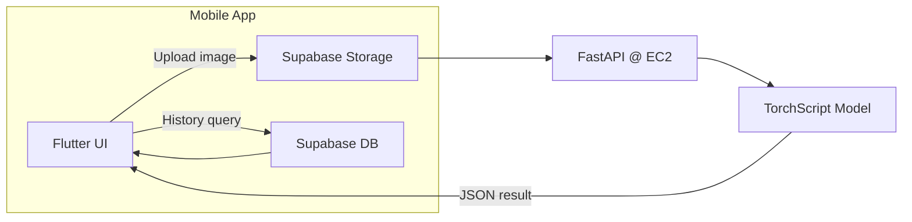
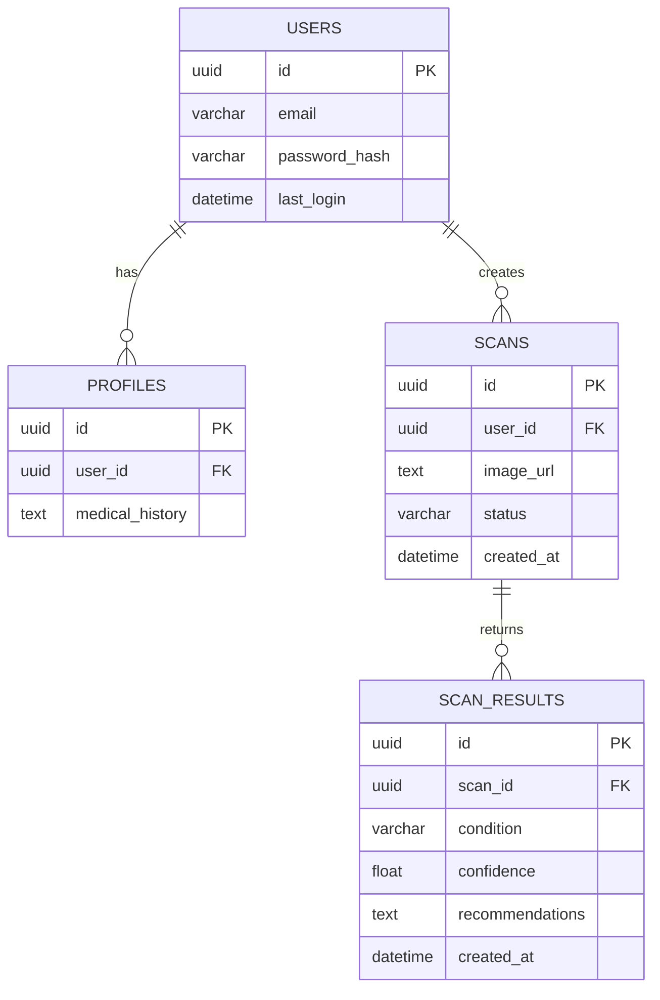
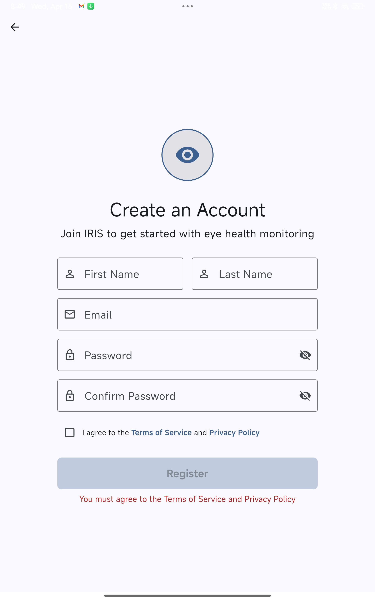
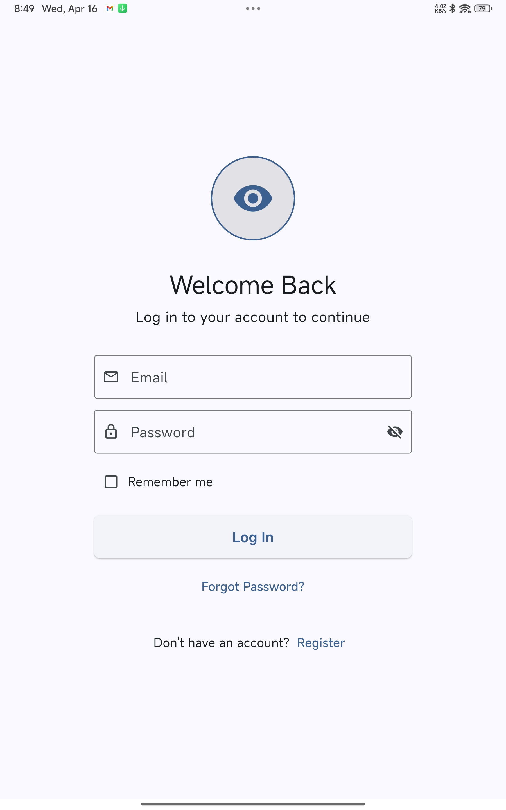
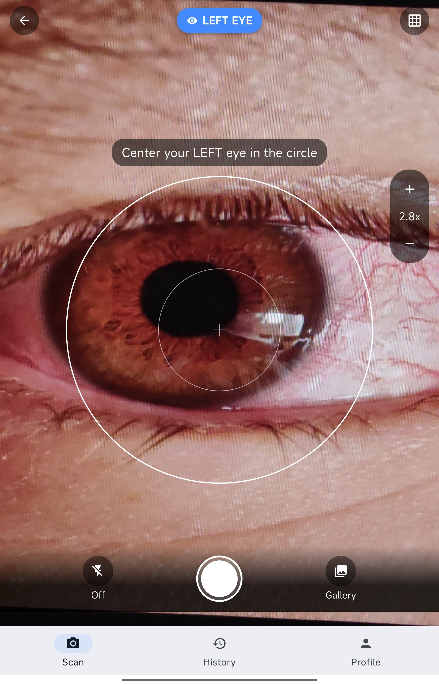
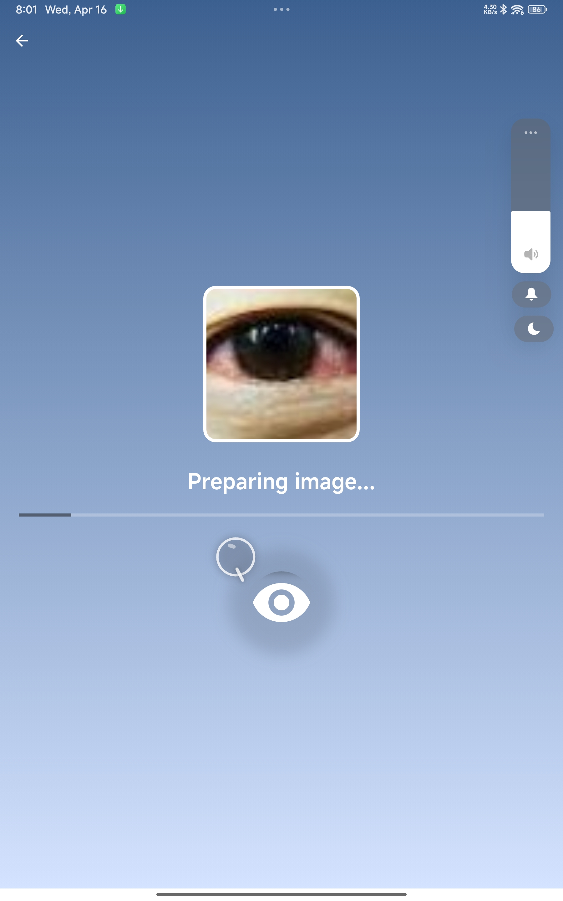
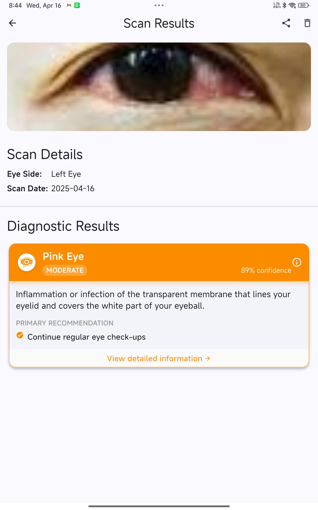
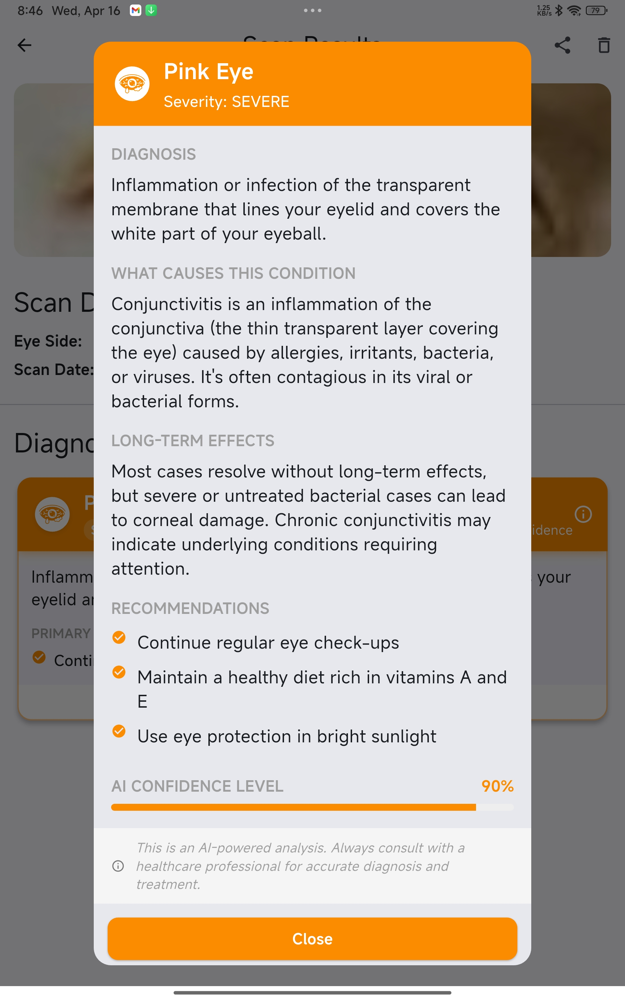
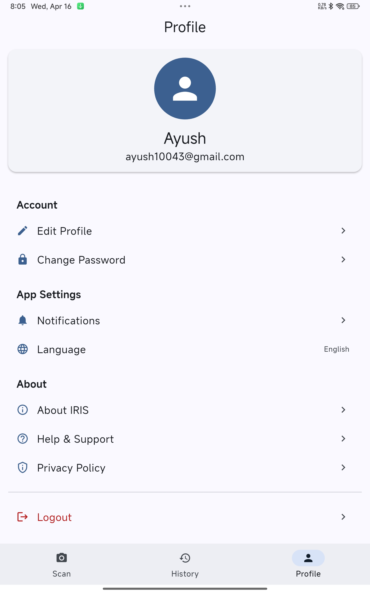

# 👁️ IRIS – Intelligent Retinal Imaging System 👁️

[](https://flutter.dev)  
[](https://fastapi.tiangolo.com)  
[](https://supabase.com)  
[](https://aws.amazon.com)

An end-to-end, **AI-powered** Flutter app for **few-shot ocular disease** screening. Capture or upload a retinal image, authenticate via Supabase, then call your AWS EC2 model back-end to get a real-time diagnosis—with history, profiles, and beautiful shader effects along the way!

---

## 📋 Table of Contents

1. [✨ Key Features](#-key-features)
2. [🎥 Demo](#-demo)  
3. [🚀 Getting Started](#-getting-started)  
   - [Prerequisites](#prerequisites)  
   - [Installation](#installation)  
   - [Environment Variables](#environment-variables)  
4. [🏗️ Project Structure](#️-project-structure)  
5. [📐 Architecture Overview](#️-architecture-overview)
6. [💾 Database Schema](#-database-schema)  
7. [📡 API Endpoints](#-api-endpoints)  
8. [📸 Screenshots](#-screenshots)  
9. [⚙️ Deployment](#️-deployment)
10. [🤝 Contributing](#-contributing)  
11. [📄 License](#-license)

---

## ✨ Key Features
- 🔐 **Supabase Auth & Profiles** – secure login/registration, patient metadata  
- 📷 **Guided Capture & Upload** – camera + gallery workflows with focus guides  
- ⚡ **Real-Time Diagnostics** – TorchScript DenseNet121 + ProtoNet served via FastAPI on AWS  
- 📊 **Rich Results** – condition, confidence, severity & recommendations, plus scan history  
- 🎨 **Animated UI** – shader backgrounds, pulsating orbs, smooth page transitions  

## 🎥 Demo

Watch IRIS in action—capture, upload, and get real-time ocular diagnostics:
<p align="center">
  <video 
    src="https://github.com/aywhoosh/IRIS/blob/main/screenshots/App%20Demo%20-%20IRIS.mp4" 
    controls 
    autoplay 
    loop 
    muted 
    width="600">
    Your browser does not support the video tag.
  </video>
</p>


---


## 🚀 Getting Started

### Prerequisites
| Stack      | Min Version | Notes                   |
| ---------- | ----------- | ----------------------- |
| Flutter    | 3.0+        | with Android/iOS tool-chain |
| Dart       | 2.17+       | Preinstalled with Flutter SDK|
| Node.js & npm | 16+      | for utilities / Supabase functions |
| Python     | 3.8+        | FastAPI back-end        |
| AWS CLI    | —           | configured for EC2/Lambda |
| Supabase CLI | —         | optional local emulation |

### Installation
```bash
# 1. Clone
git clone https://github.com/aywhoosh/IRIS-Ocular-Diagnostics.git
cd IRIS-Ocular-Diagnostics

# 2. Node tooling (if package.json present)
npm install

# 3. Flutter deps
cd app
flutter pub get
cd ..

# 4. FastAPI back-end deps
cd backend
pip install -r requirements.txt
cd ..

# 5. Model micro-service (optional)
cd model_backend
pip install -r requirements.txt
cd ..
```

### Environment Variables
- Create a .env file in /backend.
```dotenv
# Supabase
SUPABASE_URL=https://your-instance.supabase.co
SUPABASE_ANON_KEY=pk_…

# FastAPI
API_HOST=0.0.0.0
API_PORT=8000

# Model endpoint (if back-end forwards)
MODEL_API_URL=https://ec2-your-ip.compute.amazonaws.com/predict
```

---

## 🏗️ Project Structure
```plaintext
.
├── app/              # Flutter front-end
│   ├── lib/
│   │   ├── screens/
│   │   └── widgets/
│   └── pubspec.yaml
├── backend/          # FastAPI service (EC2 / container)
│   ├── main.py
│   ├── requirements.txt
│   └── .env
├── model_backend/    # Lambda or standalone model service
│   ├── serve_model.py
│   └── requirements.txt
├── screenshots/
└── README.md
```
## 📐 Architecture Overview



## 💾 Database Schema

## 📡 API Endpoints
| Verb   | Path               | Purpose                        |
|:------:|:------------------:|:-------------------------------|
| `POST` | `/api/upload`      | Store image & start processing |
| `GET`  | `/api/status/{id}` | Poll processing job            |
| `GET`  | `/api/history`     | List scans for logged-in user  |

### Example Request

    curl -X POST https://YOUR_EC2_DOMAIN/api/upload \
      -H "Authorization: Bearer <jwt>" \
      -F "file=@/path/eye.jpg"

## 📸 Screenshots

### Authentication
| Register Screen                                      | Login Screen                                         |
|:----------------------------------------------------:|:----------------------------------------------------:|
|          |                |

### Main Workflow
| Home & Camera Screen                                 | Processing Animation                                        | Scan Results                                            |
|:----------------------------------------------------:|:-----------------------------------------------------------:|:--------------------------------------------------------:|
|    |       |             |

### Details & Profile
| Detailed Diagnosis View                              | Profile Screen                                       |
|:----------------------------------------------------:|:----------------------------------------------------:|
|  |               |

## ⚙️ Deployment
1. **Supabase**  
   - Create a new project  
   - Run the provided SQL schema  
   - Configure Storage buckets  

2. **AWS EC2**  
   ```bash
   ssh ubuntu@ec2-your-ip
   git clone https://github.com/aywhoosh/IRIS-Ocular-Diagnostics.git
   cd backend
   pip install -r requirements.txt
   uvicorn main:app --host 0.0.0.0 --port 8000
   ```
- Use NGINX + SSL or Docker for a production setup.
- 3. **Flutter App**
     ```bash
      cd app
      flutter run --release

     ```


## 🤝 Contributing
1. Fork this repository  
2. Create your feature branch (`git checkout -b feature/xyz`)  
3. Commit your changes (`git commit -m "Add feature xyz"`)  
4. Push to the branch (`git push origin feature/xyz`)  
5. Open a Pull Request

## 📄 License
Distributed under the MIT License. See [LICENSE](LICENSE) for details.

